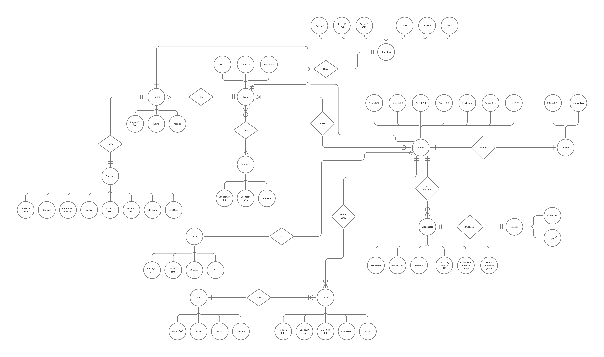

# DV200-Proctored-SQL-Exam

## International Sports League System

## Overview
This project models a database for an  **International Sports League System** based on a case study.
It captures the relationships between teams, players, matches, venues, referees, sponsors, fans, tickets, and broadcasts.

It allows for:
- Managing **teams** across countries.
- Tracking **player contracts** (salaries, bonuses, clauses).
- Scheduling **matches** across venues with referees.
- Recording **player statistics** (goals, assists, fouls).
- Handling **sponsors** for teams and matches.
- Selling **tickets** to fans.
- Managing **broadcasting rights** and revenue distributions.

---

## Entities
1. Team
2. Player
3. Contract
4. Venue
5. League_Match
6. Referee
7. Statistics
8. Fan
9. Ticket
10. Sponsor
11. Broadcasts
12. Broadcaster
13. Match_Sponsor
14. Team_Sponsor

---

## ER Diagram
The ERD below shows how entities are interconnected:

---

## Features

### Joins (Queries)
1. List all matches with referees and venues:
SELECT m.match_id, v.venue_name, r.referee_name, m.match_date
FROM league_match m
JOIN Venue v ON m.venue_id = v.venue_id
JOIN Referee r ON m.referee_id = r.referee_id;

2. Find players who scored in matches sponsored by a specific sponsor:
SELECT DISTINCT p.player_name, s.sponsor_name
FROM Player p
JOIN Statistics st ON p.player_id = st.player_id
JOIN league_match m ON st.match_id = m.match_id
JOIN Match_Sponsor ms ON m.match_id = ms.match_id
JOIN Sponsor s ON ms.sponsor_id = s.sponsor_id
WHERE st.goals > 0;

### Triggers
1. 

### Stored Procedures
1. Get player career stats across all matches:
DELIMITER //
CREATE PROCEDURE player_stats(IN playerId INT)
BEGIN
SELECT p.player_name,
SUM(goals) AS total_goals,
SUM(assists) AS total_assists,
SUM(fouls) AS total_fouls
FROM Player p
JOIN Statistics s ON p.player_id = s.player_id
WHERE p.player_id = playerId
GROUP BY p.player_name;
END //
DELIMITER ;

2. Get match details including teams, venue, referee, and sponsors:
DELIMITER //
CREATE PROCEDURE match_details(IN matchId INT)
BEGIN
SELECT m.match_id,
th.team_name AS home_team,
ta.team_name AS away_team,
v.venue_name,
r.referee_name,
GROUP_CONCAT(sp.sponsor_name) AS sponsors
FROM leaguematch m
JOIN Team th ON m.home_team_id = th.team_id
JOIN Team ta ON m.away_team_id = ta.team_id
JOIN Venue v ON m.venue_id = v.venue_id
JOIN Referee r ON m.referee_id = r.referee_id
LEFT JOIN Match_Sponsor ms ON m.match_id = ms.match_id
LEFT JOIN Sponsor sp ON ms.sponsor_id = sp.sponsor_id
WHERE m.match_id = matchId
GROUP BY m.match_id, th.team_name, ta.team_name, v.venue_name, r.referee_name;
END //
DELIMITER ;

## Links
[click here](www.google.com)
[click here](www.google.com)

## Authors
Angie van Rooyen
Onthatile Lesufi